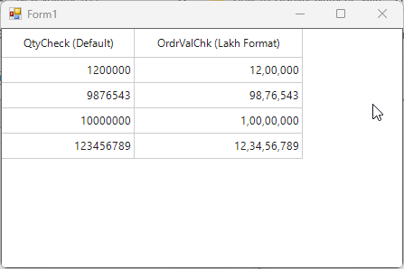

# How-to-Display-Numeric-Values-in-Indian-Lakh-Format-in-WinForms-SfDataGrid

In [Winforms DataGrid](https://www.syncfusion.com/winforms-ui-controls/datagrid) (SfDatagrid), the Indian-style lakh formatting for [GridNumericColumn](https://help.syncfusion.com/windowsforms/datagrid/columntypes#gridnumericcolumn) can be achieved by configuring the NumberGroupSizes and NumberGroupSeparator properties in the NumberFormatInfo. Set the NumberGroupSeparator property to a comma (,) to separate digit groups, and configure NumberGroupSizes as {3, 2} to reflect the Indian numbering format (e.g., 12,34,56,789). If numeric grouping is not required for certain columns, set NumberGroupSizes to an empty array { }, which disables grouping.

**C#**
```
 //Lakh formatting
 var inrFormat = Application.CurrentCulture.NumberFormat.Clone() as NumberFormatInfo;
 inrFormat.NumberDecimalDigits = 0;
 inrFormat.NumberGroupSeparator = ",";
 inrFormat.NumberGroupSizes = new[] { 3, 2 };
 column2.NumberFormatInfo = inrFormat;
```



Take a moment to peruse the [WinForms DataGrid - Data Formatting](https://help.syncfusion.com/windowsforms/datagrid/columntypes#data-formatting) documentation, to learn more about data formatting with examples.